<!--
  Profile README — Surjyava Das
  Repository: https://github.com/surjyavadas/surjyavadas

  Existing assets used:
  - dark.svg / light.svg: custom theme-aware profile artwork
  - generate_banner.py: existing banner generator (kept in the repository)
  - .github/workflows/snake.yml: contribution-snake workflow, if already configured
-->

<!-- Animated header -->

<!-- Keep the custom SVG artwork already present in this repository -->
<picture>
  <source media="(prefers-color-scheme: dark)" srcset="./dark.svg">
  <source media="(prefers-color-scheme: light)" srcset="./light.svg">
  
</picture>

<!-- Animated typing headline -->

  
  
  
  
  

---

## `whoami`

Hey! I'm **Surjyava Das**, a Computer Science student who enjoys turning ideas into useful software. I'm exploring full-stack development, Python, AI/ML, and creative technology while building projects and improving my problem-solving skills.

- 🎓 **Focus:** Computer Science & Engineering
- 🛠️ **Currently building:** Projects that combine software, automation, and practical problem-solving
- 🌱 **Learning:** Data structures, algorithms, full-stack development, and AI-powered applications
- 🎯 **Goal:** Keep learning, ship useful projects, and become a stronger software engineer

## `tech_stack`

  

## `featured_projects`

- **[Drowsiness Detection System](https://github.com/surjyavadas/Drowsiness-detection-system)** — a computer-vision project that detects driver drowsiness using a camera.
- **[Personal Portfolio](https://portfolio-surjyavadas.netlify.app/)** — my portfolio for projects, skills, and contact links.

> More projects are in progress. Visit my GitHub repositories to explore the latest work.

## `github_analytics`

<!-- These use the public github-readme-stats service; no personal Vercel deployment placeholder is required. -->

 

 

## `contribution_snake`

<!--
The snake images appear after the snake workflow completes successfully and publishes the `output` branch.
If your workflow uses a different output branch or filenames, update these URLs to match it.
-->

  <picture>
    <source media="(prefers-color-scheme: dark)" srcset="https://raw.githubusercontent.com/surjyavadas/surjyavadas/output/github-snake-dark.svg">
    <source media="(prefers-color-scheme: light)" srcset="https://raw.githubusercontent.com/surjyavadas/surjyavadas/output/github-snake.svg">
    
  </picture>

---

### `Thanks for stopping by!`

**Learn something. Build something. Repeat.**

